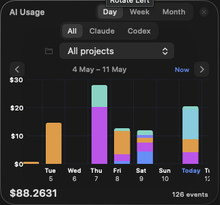
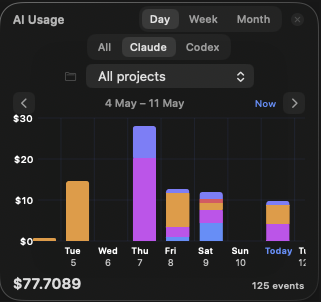
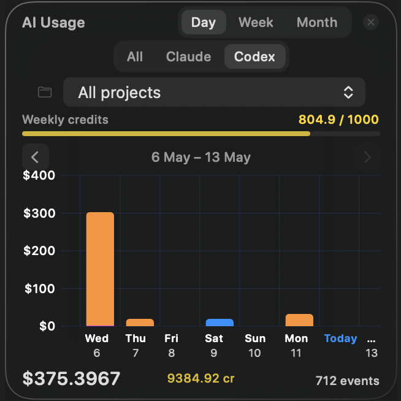
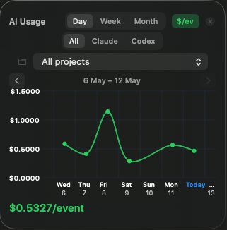

# Token Usage App

A native macOS floating widget that visualises Claude Code and Codex token costs over time, reading live from both `~/.claude/token-usage/usage.jsonl` and `~/.codex/token-usage/usage.jsonl`.

| All sources | Claude only | Codex only |
|:-----------:|:-----------:|:----------:|
|  |  |  |

## Features

Visualise AI spending (USD) across Claude and Codex sessions. Filter by tool (Claude / Codex), project, and timeframe (day / week / month).

### Spend efficiency chart ($/event)

1 event = 1 prompt submitted and responded to.

Toggle **`$/ev`** in the header to switch to the efficiency chart. Each point shows average cost per event (`total_cost_usd / stop_events`) for that bucket.

**Goal: minimise $/event without sacrificing output quality.** A downward trend means workflow changes — tighter prompts, response-compression skills, leaner context — are paying off.



## Requirements

- macOS 14 or later (runs on macOS 26 Tahoe beta)
- Claude Code with `claude-assistant@ai-plugins` installed — writes `~/.claude/token-usage/usage.jsonl`
- Codex with `codex-assistant@ai-plugins` installed — writes `~/.codex/token-usage/usage.jsonl`

Both plugins are optional — the widget shows data for whichever logs exist.

## Build & run

```bash
cd token-usage-app
./build.sh        # compile only
./build.sh run    # compile and launch
```

> **Note:** Swift Package Manager (`swift build`) has a broken ManifestAPI arm64 slice on macOS 26 beta. `build.sh` calls `swiftc` directly to work around this.

## Data sources

### Claude (`~/.claude/token-usage/usage.jsonl`)

Written by the `track-tokens.sh` Stop hook in the Claude Code plugin. `cost_usd` is the **exact value returned by the Claude API** — no estimation involved. Each line:

```json
{
  "ts": "2026-05-08T10:00:00Z",
  "session_id": "uuid",
  "model": "claude-sonnet-4-6",
  "project": "ai-plugins",
  "tokens": { "input": 45, "output": 1823, "cache_write": 8420, "cache_read": 112074 },
  "cost_usd": 0.048312
}
```

### Codex (`~/.codex/token-usage/usage.jsonl`)

Written by the `track-tokens.sh` Stop hook in the Codex plugin. Token data is sourced from `token_count` events in the Codex session transcript. Each line:

```json
{
  "ts": "2026-05-08T10:00:00Z",
  "session_id": "uuid",
  "model": "gpt-5.5",
  "project": "ai-plugins",
  "tokens": { "input": 45, "output": 1823, "cache_read": 112074, "reasoning": 342 },
  "credits": 3.031,
  "cost_usd": 0.121212
}
```

Values are incremental deltas per assistant turn, not cumulative session totals.
For Codex, `tokens.input` is fresh non-cached input only. Cached input is stored separately in `tokens.cache_read`, matching the Claude log shape.

#### How `cost_usd` is computed

The OpenAI API does not return a spend value, so cost is **approximated** from two inputs:

1. **Credit rate card** ([help.openai.com/en/articles/20001106-codex-rate-card](https://help.openai.com/en/articles/20001106-codex-rate-card)) — credits consumed per million tokens per model.
2. **Credit-to-USD rate** — derived from the assumed plan: **1000 credits/week hard cap** on a **$200/month subscription** ($46.15/week ÷ 1000 credits = **$0.04/credit**). This ratio is confirmed by cross-checking against the published API token prices, which align exactly (e.g. gpt-5.5 input: 125 credits/M × $0.04 = $5.00/M).

Formula (reasoning tokens billed at output rate):

```
credits  = (fresh_input × rate_in + (output + reasoning) × rate_out + cache_read × rate_cache) / 1,000,000
cost_usd = credits × 0.04

# Example — gpt-5.5, values from the JSON above:
credits  = (45×125 + (1823+342)×750 + 112074×12.50) / 1,000,000
         = (5,625 + 1,623,750 + 1,400,925) / 1,000,000
         = 3.031 credits
cost_usd = 3.031 × $0.04 = $0.1212
```

Credit rates per model (credits / 1M tokens, source: Codex rate card):

| Model | Input | Output | Cached input |
|-------|------:|-------:|-------------:|
| gpt-5.5 | 125 | 750 | 12.50 |
| gpt-5.4 | 62.50 | 375 | 6.25 |
| gpt-5.4-mini | 18.75 | 113 | 1.875 |
| gpt-5.3-codex | 43.75 | 350 | 4.375 |
| gpt-5.2 | 43.75 | 350 | 4.375 |

> **Note:** The $0.04/credit rate assumes a specific plan configuration. If your subscription or weekly limit differs, the actual cost per credit will vary.

## Pricing sources

| Source | Used for |
|--------|----------|
| Claude API response | Claude `cost_usd` — exact, no estimation |
| [Codex rate card](https://help.openai.com/en/articles/20001106-codex-rate-card) | Codex credit rates per model |
| [OpenAI API pricing](https://developers.openai.com/api/docs/pricing) | Cross-check: confirms 1 credit = $0.04 |
